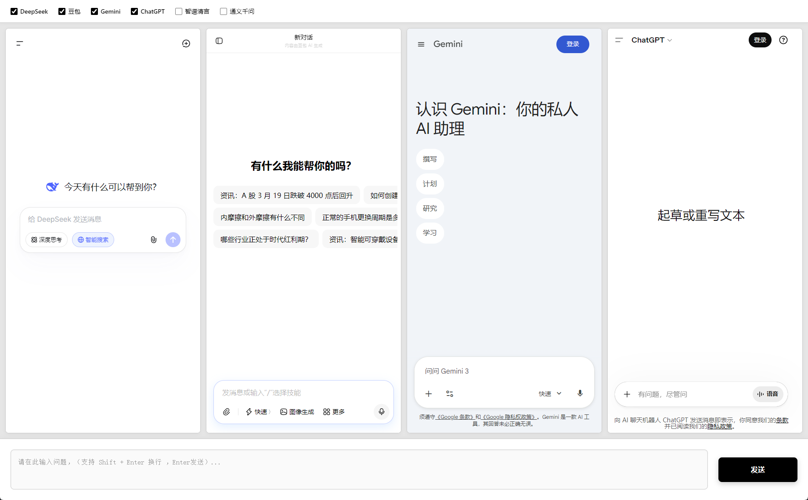

# 🤖 Electron AI Chat -多 ai 对话

> 一个基于 Electron 开发的桌面端 AI 聊天聚合工具。让你能同时与多个顶级的 AI 大语言模型进行对话，成倍提升工作效率！🚀



## ✨ 核心特性

- **🍎 多模型聚合**：在一个应用内集成四大主流 AI 聊天网站（如 ChatGPT, Gemini, 豆包, 文心一言等）。
- **⚡ 一键多发**：底部设有全局输入框，输入一条消息即可**同步发送**给当前所有的 AI 助手，方便横向对比不同模型的回答。
- **🖥️ 独立 WebView**：每个 AI 模型在独立的 WebView 中运行，沙盒隔离，互不干扰。
- **🌐 智能防伪装**：自动配置 User-Agent，防止部分 AI 网站的安全拦截，保证顺畅访问。
- **💻 跨平台桌面端**：基于 Electron 构建，拥有原生级桌面应用的体验。

## 🛠️ 技术栈

- **Electron**: `^29.x`
- **Node.js**: 运行环境
- **HTML/CSS/JS**: 原生前端三剑客

## 📦 安装与运行

1. **克隆项目 / 下载源码**

   ```bash
   git clone <仓库地址>
   cd electron-ai-chat
   ```

2. **安装依赖**

   ```bash
   npm install
   ```

3. **启动开发环境**

   ```bash
   npm start
   ```

## 🔨 打包构建

本项目集成了 `electron-builder` 进行应用打包。

**构建 Windows 版本的应用：**

```bash
npm run build
```

构建成功后，安装包与免安装版本将生成在 `dist` 目录下。

## 📁 目录结构

- `main.js`: Electron 主进程代码，管理窗口生命周期与 WebView 权限。
- `renderer.js`: 渲染进程脚本，处理 UI 交互和全局输入框的同步发送逻辑。
- `ai-models.js`: AI 模型配置文件，包含大语言模型的网址和 DOM 操作规则。
- `index.html`: 界面主结构，划分了多个浏览器视图区域和底部输入区。
- `styles.css`: 页面布局及 UI 样式。
- `package.json`: 项目依赖与脚本配置。

## 📝 待办与计划

- [ ] 支持自定义添加和配置更多的 AI 模型网址
- [ ] 增加布局切换功能（如两栏、四栏切换）
- [ ] 优化各平台 AI 的自动回复抓取或样式注入

## 📄 开源协议

MIT License
